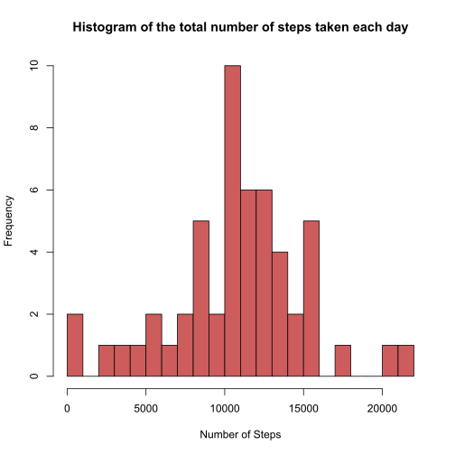
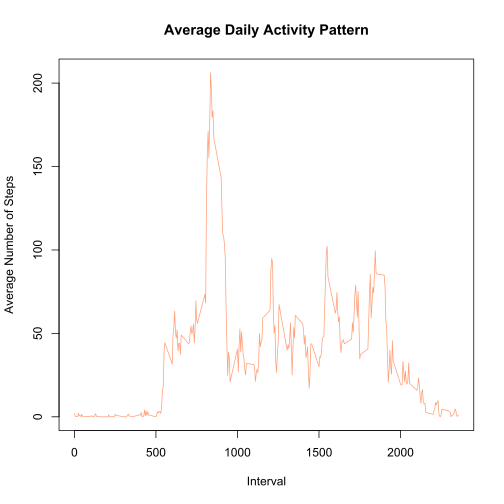
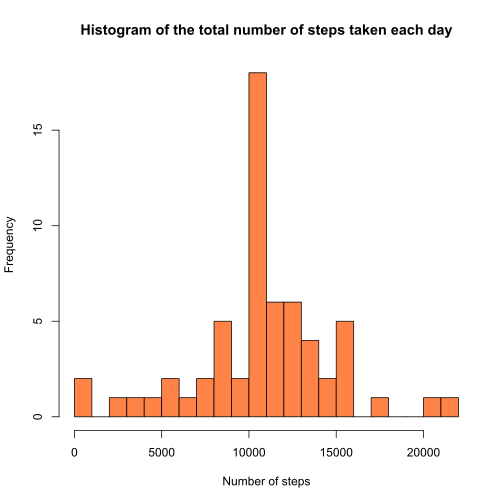
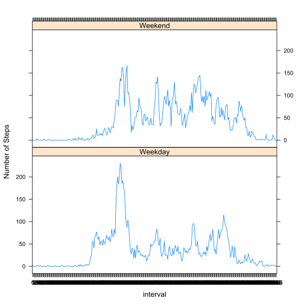

# Analysis of Personal Movement Using Activity Monitoring Devices

## Loading and preprocessing the data

1 - Reading the data:


```r
data <- read.csv("activity.csv", header = TRUE, sep = ",", na.strings = "NA")
```

2 - Summary of the data using "summary()" and "str()" methods:


```r
summary(data)
```

```
##      steps                date          interval     
##  Min.   :  0.00   2012-10-01:  288   Min.   :   0.0  
##  1st Qu.:  0.00   2012-10-02:  288   1st Qu.: 588.8  
##  Median :  0.00   2012-10-03:  288   Median :1177.5  
##  Mean   : 37.38   2012-10-04:  288   Mean   :1177.5  
##  3rd Qu.: 12.00   2012-10-05:  288   3rd Qu.:1766.2  
##  Max.   :806.00   2012-10-06:  288   Max.   :2355.0  
##  NA's   :2304     (Other)   :15840
```


```r
str(data)
```

```
## 'data.frame':	17568 obs. of  3 variables:
##  $ steps   : int  NA NA NA NA NA NA NA NA NA NA ...
##  $ date    : Factor w/ 61 levels "2012-10-01","2012-10-02",..: 1 1 1 1 1 1 1 1 1 1 ...
##  $ interval: int  0 5 10 15 20 25 30 35 40 45 ...
```

3 - The first 6 rows of the dataset:


```r
head(data)
```

```
##   steps       date interval
## 1    NA 2012-10-01        0
## 2    NA 2012-10-01        5
## 3    NA 2012-10-01       10
## 4    NA 2012-10-01       15
## 5    NA 2012-10-01       20
## 6    NA 2012-10-01       25
```

4 - Converting the "date" variable to a *Date* class:


```r
data$date <- as.Date(data$date, fomrat = "%Y-%m-%d")
```

5 - Converting the "interval" variable to a factor:


```r
data$interval <- factor(data$interval)
```

## What is mean total number of steps taken per day?

1 - Subsetting the data to ignore missing values:


```r
NA_index <- is.na(as.character(data$steps))
no_NA_data <- data[!NA_index, ]
head(no_NA_data)
```

```
##     steps       date interval
## 289     0 2012-10-02        0
## 290     0 2012-10-02        5
## 291     0 2012-10-02       10
## 292     0 2012-10-02       15
## 293     0 2012-10-02       20
## 294     0 2012-10-02       25
```

2 - Aggregating the number of steps taken each day:


```r
# Creating a data frame with the steps taken for each day

steps_each_day <- aggregate(steps ~ date, data = no_NA_data, sum)

# Adding column names to the created data frame

colnames(steps_each_day) <- c("date", "steps")
```

3 - Making a histogram of the total number of steps taken each day:


```r
hist(as.numeric(steps_each_day$steps), breaks = 20, col = "indianred", xlab = "Number of Steps", main = "Histogram of the total number of steps taken each day")
```



Also, number of steps taken per day:


```r
# Mean

mean(steps_each_day$steps)
```

```
## [1] 10766.19
```


```r
# Median

median(steps_each_day$steps)
```

```
## [1] 10765
```

## What is the average daily activity pattern?

1 - Calculating the average number of steps taken, averaged across all days:


```r
# Calculating the average

steps_per_interval <- aggregate(no_NA_data$steps, by = list(interval = no_NA_data$interval), FUN = mean)

# Adding column names

colnames(steps_per_interval) <- c("interval", "average_steps")

# Plotting the average daily activity pattern

plot(as.integer(levels(steps_per_interval$interval)), steps_per_interval$average_steps, type = "l",
     xlab = "Interval", ylab = "Average Number of Steps", main = "Average Daily Activity Pattern",  col = "lightsalmon")
```



2 - The 5-minute interval that contains the maximum number of steps:


```r
# The maximum number of average steps

max_steps <- max(steps_per_interval$average_steps)
max_steps
```

```
## [1] 206.1698
```


```r
# The 5-minute interval that contains the maximum number of steps

interval_max_steps <- steps_per_interval[which.max(steps_per_interval$average_steps), ]$interval
interval_max_steps
```

```
## [1] 835
## 288 Levels: 0 5 10 15 20 25 30 35 40 45 50 55 100 105 110 115 120 ... 2355
```

## Imputing missing values

1 - The total number of missing values in the dataset for each variable:

For the "steps" variable:


```r
sum(is.na(as.character(data$steps)))
```

```
## [1] 2304
```

For the "date" variable:


```r
sum(is.na(as.character(data$date)))
```

```
## [1] 0
```

For the "interval" variable:


```r
sum(is.na(as.character(data$interval)))
```

```
## [1] 0
```

2 - The strategy for filling in all the missing values in the dataset. Missing values are replaced by the mean of that 5-minute interval


```r
# Finding the indices of missing values (NA's)

NA_index <- which(is.na(as.character(data$steps)))
complete_data <- data

# Imputing missing values using the mean for that 5-minute interval

complete_data[NA_index, ]$steps <- unlist(lapply(NA_index, FUN = function(NA_index){
        steps_per_interval[data[NA_index, ]$interval == steps_per_interval$interval, ]$average_steps
}))
```

3 - Creating a new dataset that is equal to the original dataset, but with missing data filled in:


```r
# Checking the complete data with the summary method

summary(complete_data)
```

```
##      steps             date               interval    
##  Min.   :  0.00   Min.   :2012-10-01   0      :   61  
##  1st Qu.:  0.00   1st Qu.:2012-10-16   5      :   61  
##  Median :  0.00   Median :2012-10-31   10     :   61  
##  Mean   : 37.38   Mean   :2012-10-31   15     :   61  
##  3rd Qu.: 27.00   3rd Qu.:2012-11-15   20     :   61  
##  Max.   :806.00   Max.   :2012-11-30   25     :   61  
##                                        (Other):17202
```


```r
# Checking the complete data with the str method

str(complete_data)
```

```
## 'data.frame':	17568 obs. of  3 variables:
##  $ steps   : num  1.717 0.3396 0.1321 0.1509 0.0755 ...
##  $ date    : Date, format: "2012-10-01" "2012-10-01" ...
##  $ interval: Factor w/ 288 levels "0","5","10","15",..: 1 2 3 4 5 6 7 8 9 10 ...
```

4 - Making a histogram of the total number of steps taken each day for the completed dataset:


```r
# Creating a data frame with the steps taken for each day

steps_each_day_complete <- aggregate(steps ~ date, data = complete_data, sum)

# Adding column names to the created data frame

colnames(steps_each_day_complete) <- c("date", "steps")

# Making the histogram

hist(as.numeric(steps_each_day_complete$steps), breaks = 20, col = "sienna1", xlab = "Number of steps",
     main = "Histogram of the total number of steps taken each day")
```



5 - Calculating the mean and median total number of steps taken per day for the complete dataset


```r
# Mean

mean(steps_each_day_complete$steps)
```

```
## [1] 10766.19
```


```r
# Median

median(steps_each_day_complete$steps)
```

```
## [1] 10766.19
```

## Are there differences in activity patterns between weekdays and weekends?


```r
# Creating a factor variable "day" to store the day of the week

complete_data$day <- as.factor(weekdays(complete_data$date))

# Creating a logical variable "is_weekday" (weekday = TRUE, weekend = FALSE):

complete_data$is_weekday <- ifelse(!(complete_data$day %in% c("Saturday", "Sunday")), TRUE, FALSE)

# Calculating the average number of steps for weekdays 

weekdays_data <- complete_data[complete_data$is_weekday, ]
steps_per_interval_weekdays <- aggregate(weekdays_data$steps, by = list(interval = weekdays_data$interval), FUN = mean)

# Calculating the average number of steps for weekends

weekends_data <- complete_data[!complete_data$is_weekday, ]
steps_per_interval_weekends <- aggregate(weekends_data$steps, by = list(interval = weekends_data$interval), FUN = mean)

# Adding column names

colnames(steps_per_interval_weekdays) <- c("interval", "average_steps")
colnames(steps_per_interval_weekends) <- c("interval", "average_steps")

# Adding a column to indicate the day

steps_per_interval_weekdays$day <- "Weekday"
steps_per_interval_weekends$day <- "Weekend"

# Merging the two together

week_data <- rbind(steps_per_interval_weekends, steps_per_interval_weekdays)

# Converting the day variable to a factor

week_data$day <- as.factor(week_data$day)

# Making the plot

library(lattice)
xyplot(average_steps ~  interval | day, data = week_data, layout = c(1,2), type = "l", ylab= "Number of Steps")
```


